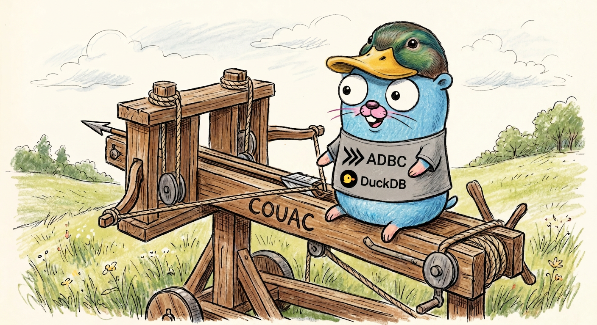

# couac 🦆🛢️♭

<p align="center">
  
</p>


[](https://pkg.go.dev/github.com/loicalleyne/couac)

Couac is a Go library that provides a convenient, ergonomic wrapper around
[ADBC](https://arrow.apache.org/adbc/) (Arrow Database Connectivity) for
[DuckDB](https://duckdb.org). It simplifies database lifecycle management,
connection tracking, query execution with Apache Arrow record batches, bulk
ingestion with automatic schema evolution, safe compaction, and much more.

## Features

| Category | Functions |
|---|---|
| **Database lifecycle** | `NewDuck`, `Close`, `Ping`, `Path`, `DriverPath` |
| **Connections** | `Connect`, `ConnectAs`, `ConnectionCount`, `Close` |
| **Query execution** | `Exec`, `Query` → `QueryResult`, `QueryRaw`, `Prepare`, `NewStatement` |
| **Transactions** | `WithTransaction` (auto commit/rollback with panic recovery) |
| **Bulk ingestion** | `Ingest`, `IngestMerge` (schema evolution via UNION BY NAME), `IngestReplace`, `IngestStream` |
| **Catalog metadata** | `Objects` → `CatalogTree` (typed getters: `Catalogs`, `Schemas`, `Tables`, `Columns`, `FindTable`, `TableExists`, `Constraints`, `Map`), `ObjectsMap`, `TableSchema`, `TableSchemaIn`, `TableTypes` |
| **System management** | `Compact` (safe disk reclamation), `Checkpoint`, `ForceCheckpoint` |
| **Attach / Detach** | `Attach` (with `ReadOnly`, `WithBlockSize`, `WithEncryptionKey` options), `Detach`, `CopyDatabase`, `Databases` |
| **Extensions & Secrets** | `Extensions`, `InstallExtension`, `LoadExtension`, `Secrets`, `ExtensionsDir`, `SecretsDir` |
| **Configuration** | `Set`, `Reset`, `Setting`, `Settings`, `LockConfiguration` |
| **Performance tuning** | `SetMemoryLimit`, `SetThreads`, `SetTempDirectory`, `SetMaxTempDirectorySize`, `SetPreserveInsertionOrder` |
| **Introspection** | `Describe`, `Summarize`, `ShowTables`, `ShowAllTables`, `Explain` |
| **Environment** | `Version`, `Platform`, `UserAgent`, `DatabaseSize`, `StorageInfo` |
| **Profiling** | `EnableProfiling`, `DisableProfiling`, `SetProfilingOutput` |
| **database/sql** | `StdDB` → `*sql.DB` (bridge for ORMs, migration tools, test harnesses; supports parameterized queries with `?` and `$N` placeholders) |

## Prerequisites

Couac uses the ADBC driver manager, which loads the DuckDB shared library at
runtime. The recommended way to install the driver is via the
[dbc](https://github.com/columnar-tech/dbc) CLI:

```sh
# macOS / Linux
curl -fsSL https://dbc.columnar.tech/install.sh | bash

# Windows (PowerShell)
powershell -ExecutionPolicy ByPass -c "irm https://dbc.columnar.tech/install.ps1 | iex"

# Or with pipx (cross-platform)
pipx install dbc

# Then install the DuckDB driver
dbc install duckdb
```

Helper scripts are provided in the `scripts/` directory:
- `scripts/install-dbc.sh` — installs dbc + DuckDB driver on macOS/Linux
- `scripts/install-dbc.ps1` — installs dbc + DuckDB driver on Windows

## Install

```sh
go get github.com/loicalleyne/couac@latest
```

## Quick start

```go
package main

import (
    "context"
    "fmt"
    "log"

    "github.com/apache/arrow-go/v18/arrow"
    "github.com/apache/arrow-go/v18/arrow/array"
    "github.com/apache/arrow-go/v18/arrow/memory"
    "github.com/loicalleyne/couac"
)

func main() {
    // Open an in-memory DuckDB database
    db, err := couac.NewDuck()
    if err != nil {
        log.Fatal(err)
    }
    defer db.Close()

    // Create a connection
    conn, err := db.Connect()
    if err != nil {
        log.Fatal(err)
    }
    defer conn.Close()

    ctx := context.Background()

    // Execute DDL
    conn.Exec(ctx, "CREATE TABLE users (id INTEGER, name VARCHAR)")
    conn.Exec(ctx, "INSERT INTO users VALUES (1, 'Alice'), (2, 'Bob')")

    // Query returns a QueryResult with a streaming Arrow RecordReader
    res, err := conn.Query(ctx, "SELECT * FROM users ORDER BY id")
    if err != nil {
        log.Fatal(err)
    }
    defer res.Close()

    for res.Reader.Next() {
        rec := res.Reader.RecordBatch()
        for i := 0; i < int(rec.NumRows()); i++ {
            fmt.Printf("id=%s name=%s\n", rec.Column(0).ValueStr(i), rec.Column(1).ValueStr(i))
        }
    }

    // Bulk ingest from an Arrow record batch
    schema := arrow.NewSchema([]arrow.Field{
        {Name: "id", Type: arrow.PrimitiveTypes.Int64},
        {Name: "tag", Type: arrow.BinaryTypes.String},
    }, nil)
    bldr := array.NewRecordBuilder(memory.DefaultAllocator, schema)
    defer bldr.Release()
    bldr.Field(0).(*array.Int64Builder).AppendValues([]int64{10, 20}, nil)
    bldr.Field(1).(*array.StringBuilder).AppendValues([]string{"a", "b"}, nil)
    rec := bldr.NewRecordBatch()
    defer rec.Release()

    n, err := conn.Ingest(ctx, "tags", rec)
    if err != nil {
        log.Fatal(err)
    }
    fmt.Printf("ingested %d rows\n", n)

    // Explore metadata with typed navigation
    objs, _ := conn.Objects(ctx)
    catalog, schema_name, table, found := objs.FindTable("tags")
    if found {
        fmt.Printf("found: %s.%s.%s (%d columns)\n",
            catalog, schema_name, table.TableName, len(table.TableColumns))
    }
}
```

See the [pkg.go.dev examples](https://pkg.go.dev/github.com/loicalleyne/couac#pkg-examples)
for more usage patterns.

## Driver discovery

Couac supports three modes for locating the DuckDB shared library:

### 1. By name (default)

```go
// Uses "duckdb" — the ADBC driver manager resolves it
// via TOML manifests installed by `dbc install duckdb`.
db, err := couac.NewDuck()

// Or explicitly:
db, err := couac.NewDuck(couac.WithDriverName("duckdb"))
```

### 2. By explicit path

```go
db, err := couac.NewDuck(
    couac.WithDriverPath("/usr/local/lib/libduckdb.so"),
)
```

### 3. Programmatic manifest lookup

```go
// Searches ADBC driver manifest directories (Env → User → System)
// using the github.com/columnar-tech/dbc/config package.
db, err := couac.NewDuck(couac.WithDriverLookup())
```

## Concurrency model

DuckDB uses MVCC with optimistic concurrency control. Within a single process:

- **Appends** never conflict, even on the same table.
- **Concurrent updates/deletes** on different rows succeed.
- **Concurrent updates/deletes** on the same row produce a conflict error.
- **Only one process** may open a database file for writing at a time.

Couac protects its internal connection list with a `sync.RWMutex`:

| Operation | Lock | Concurrency |
|---|---|---|
| Queries, ingests, DDL | **Read lock** | Fully concurrent with each other |
| `Compact`, `ForceCheckpoint`, `Close` | **Write lock** | Blocks until all in-flight operations complete; prevents new operations |

Open connections remain valid after `Compact` completes — they are not closed
or invalidated.

## Safe compaction

DuckDB does not automatically reclaim disk space from deleted or updated rows
(`VACUUM` is a no-op). Couac's `Compact` method safely reclaims space:

```go
err := db.Compact(ctx) // acquires write lock, pauses all operations
```

For **file-backed databases**, `Compact`:
1. Runs `FORCE CHECKPOINT` to flush the WAL
2. ATTACHes a temporary database file
3. Runs `COPY FROM DATABASE` to create a compacted copy
4. DETACHes and replaces the original file
5. Runs a final `FORCE CHECKPOINT`

For **in-memory databases**, only `FORCE CHECKPOINT` is run.

## database/sql integration

Couac provides a `StdDB()` method that returns a standard `*sql.DB`
backed by the same underlying DuckDB instance. This is useful for
integrating with ORMs, migration tools, or any code that expects a
`*sql.DB`:

```go
db, _ := couac.NewDuck()
defer db.Close()

stdDB := db.StdDB()
defer stdDB.Close()

var count int
stdDB.QueryRowContext(ctx, "SELECT count(*) FROM users").Scan(&count)
```

### Parameterized queries

The `database/sql` bridge supports parameterized queries with both `?`
and `$N` placeholder styles. This is the recommended way to pass user
input to queries — it prevents SQL injection and lets DuckDB optimize
the query plan.

```go
// ? placeholders
var name string
stdDB.QueryRowContext(ctx,
    "SELECT name FROM users WHERE id = ?", int64(42),
).Scan(&name)

// $N placeholders
var count int
stdDB.QueryRowContext(ctx,
    "SELECT count(*) FROM events WHERE ts > $1 AND category = $2",
    time.Now().Add(-24*time.Hour), "login",
).Scan(&count)
```

Supported Go parameter types:

| Go type | Arrow type | DuckDB type |
|---|---|---|
| `int64` | Int64 | `BIGINT` |
| `float64` | Float64 | `DOUBLE` |
| `bool` | Boolean | `BOOLEAN` |
| `string` | String | `VARCHAR` |
| `[]byte` | Binary | `BLOB` |
| `time.Time` | Timestamp(µs, UTC) | `TIMESTAMP` |
| `couac.Decimal` | Decimal128 | `DECIMAL` |
| `nil` | Null | `NULL` |

`couac.NullDecimal` is also accepted — a `NullDecimal` with `Valid=false`
binds as NULL.

> **Note**: Named parameters (`$name`) are not supported by DuckDB's
> ADBC driver. Only positional `?` and `$N` placeholders are supported.

### Prepared statements

```go
stmt, err := stdDB.PrepareContext(ctx, "INSERT INTO scores VALUES (?, ?)")
if err != nil {
    log.Fatal(err)
}
defer stmt.Close()

for _, p := range players {
    stmt.ExecContext(ctx, p.Name, p.Score)
}
```

### Transactions

```go
tx, err := stdDB.BeginTx(ctx, nil)
if err != nil {
    log.Fatal(err)
}
tx.ExecContext(ctx, "UPDATE account SET balance = balance - ? WHERE id = ?", int64(100), int64(1))
tx.ExecContext(ctx, "UPDATE account SET balance = balance + ? WHERE id = ?", int64(100), int64(2))
if err := tx.Commit(); err != nil {
    log.Fatal(err)
}

// Read-only transactions
tx, err = stdDB.BeginTx(ctx, &sql.TxOptions{ReadOnly: true})
```

DuckDB does not support configurable isolation levels; any level other
than `sql.LevelDefault` returns an error.

### Native type mapping

Column values are returned as native Go types matching the underlying Arrow
column type — no blanket string conversion. The complete mapping:

| DuckDB / Arrow type | Go type |
|---|---|
| `BOOLEAN` | `bool` |
| `TINYINT` / `SMALLINT` / `INTEGER` / `BIGINT` | `int8` / `int16` / `int32` / `int64` |
| `UTINYINT` / `USMALLINT` / `UINTEGER` / `UBIGINT` | `uint8` / `uint16` / `uint32` / `uint64` |
| `FLOAT` | `float32` |
| `DOUBLE` | `float64` |
| `VARCHAR` | `string` |
| `BLOB` | `[]byte` |
| `TIMESTAMP` / `DATE` / `TIME` | `time.Time` |
| `DECIMAL` | `couac.Decimal` |
| `INTERVAL` / `DURATION` | `int64` (duration) or `string` (interval) |
| `ENUM` | `string` |
| `LIST` / `LARGE_LIST` / `FIXED_SIZE_LIST` | `couac.List` |
| `STRUCT` | `couac.Struct` |
| `MAP` | `couac.Map` |
| `UNION` | `string` (JSON) |
| `NULL` | `nil` |

### Decimal support

The `Decimal` type provides arbitrary-precision decimal values with
lossless `BigFloat()`, lossy `Float64()`, and formatted `String()`
conversions. It implements `sql.Scanner` and `driver.Valuer` for
round-trip support.

`NullDecimal` follows the same pattern as `sql.NullString` and
`sql.NullInt64` for nullable decimal columns:

```go
// Non-nullable decimal
var d couac.Decimal
row.Scan(&d)
precise := d.BigFloat() // lossless *big.Float
approx  := d.Float64()  // lossy float64
text    := d.String()   // "123.45"

// Nullable decimal
var nd couac.NullDecimal
row.Scan(&nd)
if nd.Valid {
    fmt.Println(nd.Decimal.BigFloat())
}
```

### List, Struct, and Map support

DuckDB's nested column types (`LIST`, `STRUCT`, `MAP`) are returned as
rich Go types with recursive conversion — no JSON parsing required.

**`List`** wraps `[]any` and represents `LIST`, `LARGE_LIST`, and
`FIXED_SIZE_LIST` columns. Elements are native Go types (int32, string,
nested List/Struct/Map, etc.):

```go
var l couac.List
row.Scan(&l)
fmt.Println(l.Values)    // []any{1, 2, 3}
ints := l.Ints()         // []int64{1, 2, 3}
floats := l.Floats()     // []float64{1.0, 2.0, 3.0}
strs := l.Strings()      // []string{"1", "2", "3"}
bools := l.Bools()       // []bool{true, false}
jsonL := l.JSON()        // List with all elements as JSON strings
j, _ := l.MarshalJSON()  // [1,2,3]
```

**`Struct`** wraps `map[string]any` and represents `STRUCT` columns:

```go
var s couac.Struct
row.Scan(&s)
name, ok := s.Get("name")  // convenience accessor
fmt.Println(s.Fields)       // map[string]any{"name": "Alice", "age": int32(30)}
jsonS := s.JSON()            // Struct with all values as JSON strings
```

**`Map`** wraps `map[string]any` and represents `MAP` columns:

```go
var m couac.Map
row.Scan(&m)
val, ok := m.Get("key1")   // convenience accessor
keys := m.Keys()            // []string{"key1", "key2"}
jsonM := m.JSON()            // Map with all values as JSON strings
```

All three types implement `sql.Scanner`, `driver.Valuer`, and
`json.Marshaler`. Nullable variants `NullList`, `NullStruct`, and
`NullMap` follow the `sql.NullString` pattern:

```go
var nl couac.NullList
row.Scan(&nl)
if nl.Valid {
    fmt.Println(nl.List.Ints())
}
```

Nested types can be passed as query parameters — they are
JSON-serialized for binding:

```go
l := couac.List{Values: []any{int64(1), int64(2), int64(3)}}
stdDB.QueryRowContext(ctx, "SELECT ?::INTEGER[]", l)
```

The `*sql.Rows` returned by `StdDB()` queries support column type
introspection via `ColumnTypes()`:

```go
rows, _ := stdDB.QueryContext(ctx, "SELECT id, price FROM products")
types, _ := rows.ColumnTypes()
for _, ct := range types {
    fmt.Printf("%s: %s (scan: %v)\n",
        ct.Name(),
        ct.DatabaseTypeName(), // "INTEGER", "DECIMAL", "VARCHAR", etc.
        ct.ScanType(),         // reflect.Type of the Go value
    )
    // DecimalSize() returns precision/scale for DECIMAL columns
    if p, s, ok := ct.DecimalSize(); ok {
        fmt.Printf("  precision=%d scale=%d\n", p, s)
    }
    // Nullable() reports whether the column allows NULLs
    if nullable, ok := ct.Nullable(); ok {
        fmt.Printf("  nullable=%v\n", nullable)
    }
}
```

### Implemented driver interfaces

The `database/sql` bridge implements the following `database/sql/driver`
interfaces for full integration with the standard library:

| Interface | Type | Purpose |
|---|---|---|
| `driver.Connector` | `dbConnector` | Connection factory for `sql.OpenDB` |
| `driver.Conn` | `sqlConn` | Base connection |
| `driver.ConnPrepareContext` | `sqlConn` | Context-aware `Prepare` |
| `driver.ConnBeginTx` | `sqlConn` | Context + `TxOptions` for `BeginTx` |
| `driver.ExecerContext` | `sqlConn` | One-shot exec (no Prepare round-trip) |
| `driver.QueryerContext` | `sqlConn` | One-shot query (no Prepare round-trip) |
| `driver.NamedValueChecker` | `sqlConn` | Accept `Decimal`/`NullDecimal`/`List`/`Struct`/`Map` params |
| `driver.Stmt` | `sqlStmt` | Prepared statement |
| `driver.StmtExecContext` | `sqlStmt` | Parameterized exec with context |
| `driver.StmtQueryContext` | `sqlStmt` | Parameterized query with context |
| `driver.Tx` | `sqlTx` | Transaction commit/rollback |
| `driver.Rows` | `sqlRows` | Row iteration over Arrow batches |
| `driver.RowsColumnTypeScanType` | `sqlRows` | Go `reflect.Type` for each column |
| `driver.RowsColumnTypeDatabaseTypeName` | `sqlRows` | DuckDB type name per column |
| `driver.RowsColumnTypeNullable` | `sqlRows` | Nullability per column |
| `driver.RowsColumnTypePrecisionScale` | `sqlRows` | Precision/scale for `DECIMAL` |

## DuckDB ADBC limitations

DuckDB's ADBC driver supports the full ADBC specification with these exceptions:

| Feature | Status | Couac workaround |
|---|---|---|
| `IngestMode.CreateAppend` | ❌ Not supported | `Ingest` probes with `GetTableSchema`, switches between Create/Append |
| Statement-level `AutoCommit` | ❌ Not supported | `WithTransaction` uses explicit `BEGIN`/`COMMIT`/`ROLLBACK` SQL |
| `ReadPartition` / `ExecutePartitions` | ❌ N/A | Not applicable to a non-distributed database |
| `VACUUM` | No-op | `Compact` uses `COPY FROM DATABASE` for true space reclamation |

## Migration guide

If upgrading from an older version of couac, note the following breaking changes:

### `Catalog()` / `DBSchema()` return `string` instead of `*string`

```go
// Old
catalog := conn.Catalog()  // *string
schema  := conn.DBSchema() // *string

// New
catalog := conn.Catalog()  // string
schema  := conn.DBSchema() // string
```

### Type renames (with `go:fix inline` migration)

The primary types have been renamed for clarity. The old names remain as
type aliases with `//go:fix inline` directives, so running `go fix ./...`
(Go 1.26+) will automatically update your code:

```go
// Old → New (automatically fixable with go fix)
couac.Quacker    → couac.DB
couac.QuackCon   → couac.Conn
couac.DBObject   → couac.CatalogInfo
couac.DBSchema   → couac.SchemaInfo  // the type; method DBSchema() is unchanged
couac.DBObjects  → couac.CatalogTree
```

### Method renames

Connection and query methods have been renamed. Deprecated wrappers are
provided for the old names:

```go
// Old → New
db.NewConnection()                      → db.Connect()
db.NewConnectionWithOpts(cat, sch)      → db.ConnectAs(cat, sch)
conn.IngestCreateAppend(ctx, tbl, rec)  → conn.Ingest(ctx, tbl, rec)
conn.IngestCreateAppendMerge(...)       → conn.IngestMerge(...)
conn.GetObjects(ctx, opts...)           → conn.Objects(ctx, opts...)
conn.GetObjectsMap(ctx)                 → conn.ObjectsMap(ctx)
conn.GetTableSchema(ctx, &c, &s, tbl)  → conn.TableSchema(ctx, tbl)
                                        → conn.TableSchemaIn(ctx, c, s, tbl)
conn.GetTableTypes(ctx)                 → conn.TableTypes(ctx)
conn.GetSetting(ctx, key)              → conn.Setting(ctx, key)
```

### `GetTableSchema` replaced with `TableSchema` / `TableSchemaIn`

The `*string` parameters have been removed:

```go
// Old
s, err := conn.GetTableSchema(ctx, &catalog, &schema, "table")

// New — uses connection defaults
s, err := conn.TableSchema(ctx, "table")

// New — explicit catalog/schema (plain strings, empty = default)
s, err := conn.TableSchemaIn(ctx, "memory", "main", "table")
```

### `Query` returns `*QueryResult` instead of 4 values

```go
// Old
rr, stmt, n, err := conn.Query(ctx, "SELECT 1")
defer rr.Release()
defer stmt.Close()

// New
res, err := conn.Query(ctx, "SELECT 1")
defer res.Close()
rr := res.Reader          // array.RecordReader
n  := res.RowsAffected    // int64

// If you need the original 4-return form:
rr, stmt, n, err := conn.QueryRaw(ctx, "SELECT 1")
```

### Constructor signature change

```go
// Old
db, err := couac.NewDB("path.db")

// New
db, err := couac.NewDuck(couac.WithPath("path.db"))
```

## Type aliases

For backward compatibility, the following type aliases are provided with
`//go:fix inline` directives (Go 1.26+):

```go
type Quacker      = DB          // go:fix inline
type QuackCon     = Conn        // go:fix inline
type DuckDatabase = DB          // go:fix inline
type Connection   = Conn        // go:fix inline
type DBObject     = CatalogInfo // go:fix inline
type DBSchema     = SchemaInfo  // go:fix inline
type DBObjects    = CatalogTree // go:fix inline
type Statement    = adbc.Statement
```

## 💫 Show your support

Give a ⭐️ if this project helped you!
Feedback and PRs welcome.

## License

Couac is released under the Apache 2.0 license. See [LICENCE.txt](LICENCE.txt)